# AWS IaC Security Sentinel: Automated Terraform Scanning

## 🚀 Project Overview
This project implements a **"Policy-as-Code"** pipeline using AWS CodeBuild and Checkov. It serves as a security gate that automatically scans Terraform infrastructure code before deployment.

If a developer attempts to provision insecure cloud resources (e.g., unencrypted S3 buckets or open Security Groups), the pipeline **blocks the build** and provides a detailed compliance report.

## 🏗️ Architecture
**Terraform** (IaC) ➔ **AWS CodeBuild** (CI) ➔ **Checkov** (Static Analysis) ➔ **Build Pass/Fail Decision**

## 🛠️ Tech Stack
* **Cloud Provider:** AWS
* **Infrastructure as Code:** Terraform
* **Security Tool:** Checkov (Bridgecrew)
* **CI/CD:** AWS CodeBuild
* **Key Compliance Checks:**
    * ✅ S3 Encryption at Rest (AES-256)
    * ✅ Block Public Access (S3)
    * ✅ S3 Versioning Enabled

## 🛡️ Workflow Logic
1.  **Scan:** The pipeline scans `main.tf` against 1000+ security policies.
2.  **Enforce:** If `HIGH` severity issues are found, the build fails (Exit Code 1).
3.  **Suppress:** False positives or accepted risks are managed via inline code comments (Exception Handling).

```mermaid
graph LR
A[Developer Commit] -- Terraform --> B(GitHub)
B -- Trigger --> C{AWS CodeBuild}
C -- Run Scan --> D[Checkov Analysis]
D -- Found Risks? --> E{Decision}
E -- Yes (Critical) --> F[❌ BLOCK BUILD]
E -- No (or Suppressed) --> G[✅ PASS & PROVISION]
style F fill:#ff0000,stroke:#333,stroke-width:2px
style G fill:#00ff00,stroke:#333,stroke-width:2px
```

